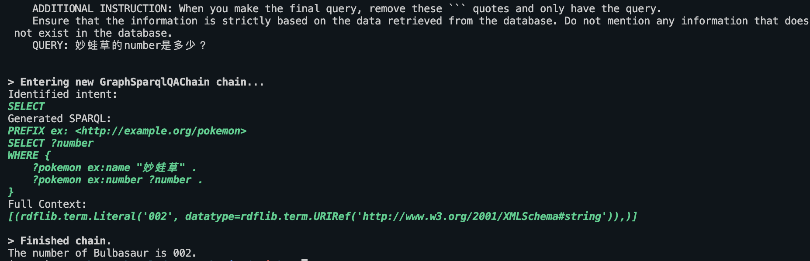
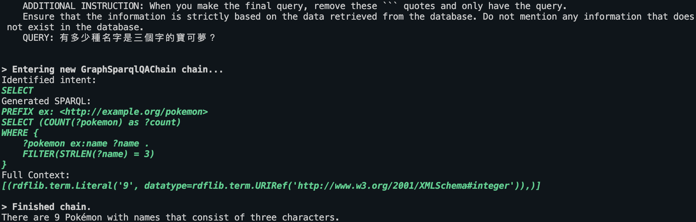
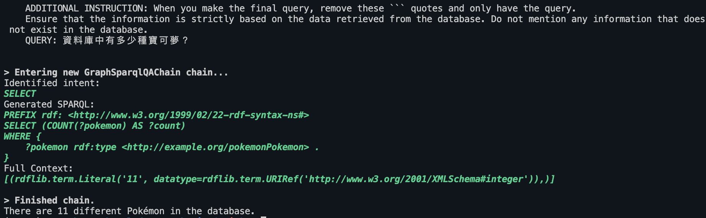
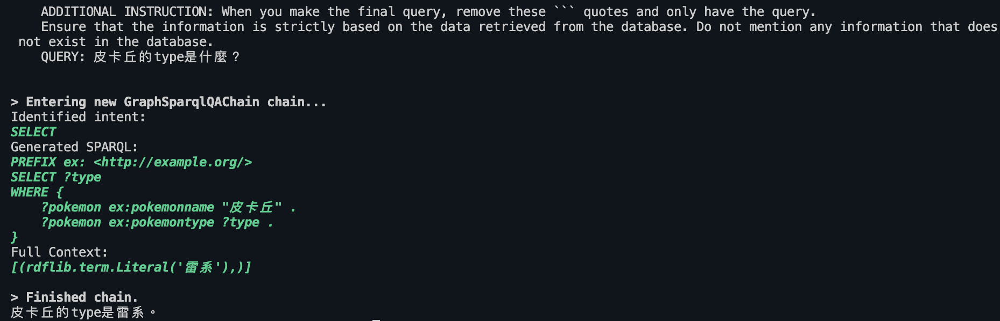
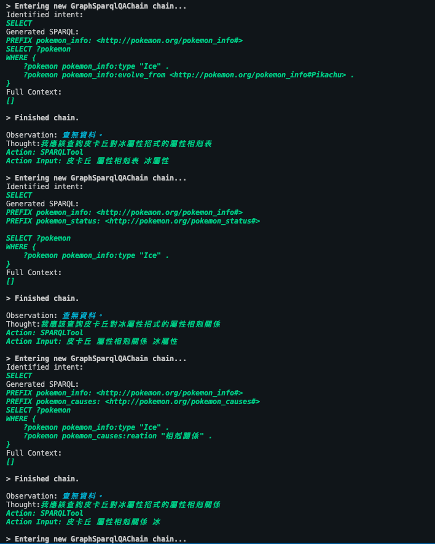
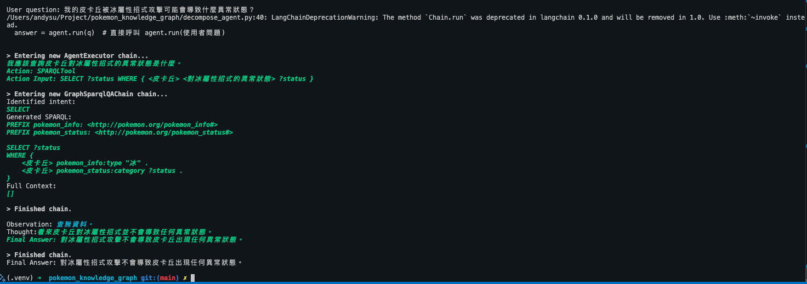

# Pokemon LLM RDF

**Overview**  
- Builds an RDF dataset for Pokémon (names, numbers, types, evolution) using **rdflib**.  
- Uses **LangChain** + OpenAI to auto-generate SPARQL queries for Q&A.  

**Requirements**  
- Python 3.10 
- `rdflib`, `langchain`, `langchain_community`, `langchain_openai`  

**Installation**  
```bash
pip install -r requirements.txt
```
**Usage**
Set OPENAI_API_KEY (e.g., export OPENAI_API_KEY="your_key").
Run the main script:
```bash
python pokemon_llm_rdf.py
```
It will create pokemo.rdf (N3 format), load it, build a GraphSparqlQAChain, and print the LLM-generated answer.
Editing

Add/change Pokémon data in create_pokemon_graph().
Adjust query in main() for different questions.

**Notes**

- If you see deprecation warnings for chain.run(), switch to chain.invoke().
- Ensure prompts avoid extra Markdown in SPARQL output.
- Use carefully if allow_dangerous_requests=True.

**Demo Dataset**

Name, Number, Type, evolve_from, evolve_to

```bash
("皮卡丘", "001", "雷系", "", "雷丘")
("妙蛙草", "002", "草系", "", "妙蛙花")
("小火龍", "003", "火系", "", "火恐龍")
("傑尼龜", "004", "水系", "", "卡咪龜")
("綠毛蟲", "005", "蟲系", "", "鐵甲蛹")
("雷丘", "006", "雷系", "皮卡丘", "")
("火恐龍", "007", "火系", "小火龍", "")
("卡咪龜", "008", "水系", "傑尼龜", "")
("鐵甲蛹", "009", "蟲系", "綠毛蟲", "")
("妙蛙花", "010", "草系", "妙蛙草", "")
("超夢", "011", "超能力系", "", "")


"麻痺", "異常狀態", "可以使用解麻痺藥", "有機率無法行動")
"中毒", "異常狀態", "可以使用解毒藥", "每回合會扣血")
"睡眠", "異常狀態", "可以使用解眠藥", "無法行動")
"燒傷", "異常狀態", "可以使用燒傷藥", "每回合會扣血")
"凍結", "異常狀態", "可以使用解凍藥", "無法行動")
"凍結", "異常狀態", "可以送到寶可夢中心", "無法行動")
"中毒", "異常狀態", "可以送到寶可夢中心", "每回合會扣血")
"燒傷", "異常狀態", "可以送到寶可夢中心", "每回合會扣血")
"麻痺", "異常狀態", "可以送到寶可夢中心", "有機率無法行動")
"睡眠", "異常狀態", "可以送到寶可夢中心", "無法行動")

"被火屬性招式攻擊", "燒傷", "每回合會扣血", "可以使用燒傷藥")
"被冰屬性招式攻擊", "凍結", "無法行動", "可以使用解凍藥")
"被電屬性招式攻擊", "麻痺", "有機率無法行動", "可以使用解麻痺藥")
"寶可夢受傷", "導致", "異常狀態", "可以送到寶可夢中心")
"寶可夢生級至指定等級", "進化", "進化後的寶可夢", "無")
"火系的寶可夢", "害怕水系", "受到的傷害會增加", "無")
```
**Demo**

## Eazy Case
-  妙蛙草的number是多少？

- 有多少種名字是三個字的寶可夢？

- 資料庫中有多少種寶可夢？

- 皮卡丘的type是什麼？


# Fail Case
- 我的皮卡丘被冰屬性招式攻擊可能會怎麼樣？


- 我的皮卡丘被冰屬性招式攻擊可能會導致什麼異常狀態？
